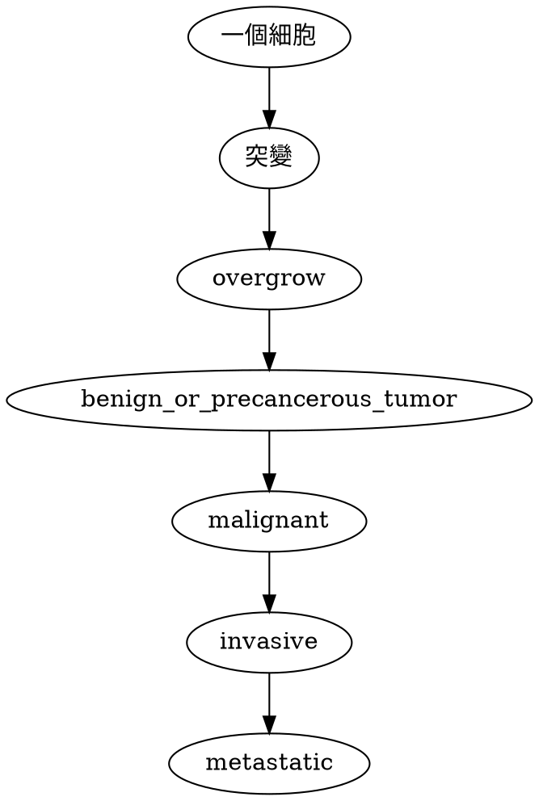

# 莊曜宇

>[time=Saturday Jan, 04, 2020]
>[time=Wednesday Jan, 08, 2020]

<iframe width="500" height="150" scrolling="no" frameborder="no" allow="autoplay" src="https://w.soundcloud.com/player/?url=https%3A//api.soundcloud.com/tracks/668254808&color=%23eb734c&auto_play=false&hide_related=false&show_comments=false&show_user=true&show_reposts=false&show_teaser=false&visual=true"></iframe>

# part 1

electrophoresis 電泳  
plasmids 質體 = cloning vectors 選殖載體  

## DNA cloning

 {→|restriction enzymes} cut 細菌殖體&人類DNA(用同一個) → produce sticky ends {→|DNA ligase} bond with complementary sticky ends  
 
![[莊曜宇-1.png]]

<!-- Fig. 20-3-3 -->

![[莊曜宇-2.png]]

original plasmid: called <u>cloning vector</u>, 帶 DNA進去宿主細胞 then replicate

<!-- Fig. 20-2 -->
![[莊曜宇-3.png]]

genomic library: 把很多 DNA clone 到噬菌體裡

<!-- Figure 20.5 -->

![[莊曜宇-4.png]]

bacterial artificial chromosome (BAC): 

- 被 trimmed down 的 大質體，可 carry 很多 DNA  
- 有用在 DNA library 

complementary DNA (cDNA) library: 生物體外，反轉錄 mRNA  

  <!-- Fig. 20-6-5 -->

  ![[莊曜宇-5.png]]

nucleic acid hybridization: nucleic acid probe  
  
  ![[莊曜宇-6.png]]

## ==看不懂==

<!-- Fig. 20-7 -->

![[莊曜宇-7.png]]

### expression vector

![[莊曜宇-8.png]]

### DNA Sequencing

- dideoxy chain termination method
- modified nucleotides: dideoxyribonucleotides (ddNTP)  
- each type of ddNTP 有螢光標記，to identify the nucleotide at the end of each DNA fragments
- DNA sequcnce can be read from spectrogram

<!-- Fig. 20-12 -->

![[莊曜宇-9.png]]

自動定序儀:

![[莊曜宇-10.png]]

### Bioinformatics

![[莊曜宇-11.png]]

homologous: 同源

Ortholog: 異物種同源基因

rodent: 囓齒動物

DNA mircroarray assays 基因晶片: compare gene expression

<!--   Fig. 20-15 -->
  ![[莊曜宇-12.png]]
  ![[莊曜宇-13.png]]
  
  ![[莊曜宇-14.png]]

---
```sequence
amy->ooo:fuckyou
```

# part 2

alleles: 等位基因

gel electrophoresis: 

- 凝膠電泳
- separate by size
  
  ![[莊曜宇-15.png]]
  
restriction fragment analysis: 

compare 2 不同 DNA 分子，如等位基因

![[莊曜宇-16.png]]

## Blotting

Southern Blotting 南方墨點法: 利用探針偵測由凝膠電泳分離出來的 <font color="FF6000">DNA</font> 片段，尋找含有特定序列的 <font color="FF6000">DNA</font> 片段
  ![[莊曜宇-17.png]]

Northern Blotting 北方墨點法: 利用探針偵測由凝膠電泳分離出來的 <font color="FF6000">mRNA</font> 片段，尋找含有特定序列的 <font color="FF6000">mRNA</font> 片段

Western & Eastern Blotting: 蛋白質相關

## Sequencing

![[莊曜宇-18.png]]

fold coverage: 做幾次 sequencing, expressed as 7×, 8×, etc.

### Illumina Sequencing Technology

![[莊曜宇-19.png]]

deblock

Reverse transcriptase-polymerase chain reaction (RT-PCR) 反轉錄 PCR: mRNA {→|反轉錄} cDNA {→|PCR} DNA 複製

  ![[莊曜宇-20.png]]

### Mircoarray vs. NGS

![[莊曜宇-21.png]]

de novo: 從頭定序（_de novo _sequencing），是指不使用參考序列（reference sequence）來組裝定序結果

### 判定基因功用

把基因關掉看看會怎樣

1. 生物體外，clone 突變基因
2. 更改或弄掉這個基因
    - 用 [RNAi (RNA interference)][RNAi]
4. 弄回生物體

[RNAi]: #RNAi-RNA-interference

### RNAi (RNA interference)

雙鏈 RNA {→|Dicer 酶} siRNA {→|與其他東西結合} RICS {→|降解 mRNA} 阻斷基因表現

![[莊曜宇-22.png]]

siRNA: small interfering RNA  
dsRNA: double-stranded RNA  
ssRNA: single-stranded RNA  
RISC: RNA-induced silencing complex，每個都包含一個 siRNA 和一個不同於 Dicer 的 RNA 酶  
degradation: 降解 (分解)
  
exonuclease: 核酸外切酶

### genetic markers

- Single nucleotide polymorphisms (SNPs, 單核苷酸多型性)
- 加上限制酶 → 不同長度的 DNA 片段 — restriction fragment length polymorphism (RFLP, 限制片段長度多型性)
- 標記治病等位基因 → test genetic disorders

Single nucleotide polymorphisms (SNPs, 單核苷酸多型性): 單個核苷酸—A,T,C或G的改變而引起的DNA序列的改變

restriction fragment length polymorphism (RFLP, 限制片段長度多型性): 每個個體的酶切位點之間的距離會有差距，這樣限制性片段的長度有區別，不同個體的某個條帶的位置也會不同（也就是「多態性」）。這樣就能從遺傳水平上區分不同個體。RFLP也可以揭示不同個體之間的遺傳關係，因爲孩子從父母處繼承了染色體。這種技術也可以用來判斷各個種的生物之間的關係。

## animal cloning

Dolly sheep: from 乳腺細胞細胞核

 ```graphviz
 digraph{
     白面母羊乳房細胞核與黑面母羊去核卵 -> 體外培養 -> 移到另一隻黑面母羊子宮
 }
 ```
 
白面母羊乳房細胞核+黑面母羊去核卵 → 體外培養 → 移到另一隻黑面母羊子宮

![[莊曜宇-23.png]]

**😱 外觀 & 行為不是一定一樣 (如同卵雙胞胎)**

- 大部分複製胚胎都無法存活到出生
- 很多表觀遺傳變化(acetylation 乙醯化 & methylation 甲基化)都要先被 reversed

ES cell: 

- embryonic stem cell 胚胎幹細胞
- 可 skin cell → ES cell，稱為 iPS cell, induced pluripotent cells, 誘導性多功能幹細胞)


  ![[莊曜宇-24.png]]

### gene therapy 基因治療

- 改變缺陷基因

  ![[莊曜宇-25.png]]

leukemia 白血病

可以讓 host cell 主動分泌出叫他製作的 protein  
→ 不需純化過程，簡化 insulin, human growth hormones, and vaccines 等的製造

STR: 

- short tandem repeats 短序重複序列
- 不同人(除同卵)之間具同 STR 的機率極低 → 用來鑑定各種關係

# Part 3 基因體學，蛋白體學

![[莊曜宇-26.png]]

![[莊曜宇-27.png]]

![[莊曜宇-28.png]]

physical map: distance between genetic markers

haploid: 單倍體

shotgun DNA sequencing (霰彈槍定序): Randomly sequence fragments {→|computer} 連續 sequence
  - 不需要全部 mapping 但可能定到之前定過的

extranuclear DNA (核外 DNA): 葉綠體、粒線體

真核基因組有重複序列  
  
coding region - only 2% of our genome  

![[莊曜宇-29.png]]

![[莊曜宇-30.png]]

phenotype: 表型

More Complex Organisms Have Decreased Gene Density

![[莊曜宇-31.png]]

morphological: 型態的

2D gel electrophoresis 二維電泳: 把蛋白質放進 pH gradient，蛋白質分子會根據自己的帶電跑到能讓自己 0 帶電處

![[莊曜宇-32.png]]  

mass spectroscopy 質譜儀: 測量分解前&分解(為小段)後之 peptide → 判定 possible codon sequences that could encode such peptide

![[莊曜宇-33.png]]

### Proteomes 蛋白體

![[莊曜宇-34.png]]

比 genomes 多，因為：

- 1 pre-mRNA → many ver.
- 專一性 (應對特定細胞、環境)
- modification
    - phosphorylation (磷酸化), methylation(甲基化), acetylation (ishi 化)

![[莊曜宇-35.png]]

# part 4 細胞週期

正常細胞分裂 50 次後死亡因為 <u>端粒 (tolemere)</u> 在 DNA 複製時縮短

apoptosis 細胞自噬: 胚胎發育過程 or 受損細胞

癌細胞不理一般細胞週期

![[莊曜宇-36.png]]

![[莊曜宇-37.png]]

![[莊曜宇-38.png]]

mitosis: 有絲分裂

### 兩種蛋白 involved

- cyclin  
  : 細胞週期蛋白
- Cdk, cyclin-dependent kinases
  : controlled by cyclin so 會波動

MPF, maturation-promoting factor: - cyclin-Cdk complex

$G_2$ → M

![[莊曜宇-39.png]]

![[莊曜宇-40.png]]

platelet  : 血小板

signs at checkpoint:

- internal signs 如東西還沒接好
    e.g. kinetochores (著絲粒) not attached to spindle microtubules send a molecular signal that delays anaphase
- external signs 如促進分化的蛋白質
  e.g. PDGF 促進分化 fibrolast cell
![[莊曜宇-41.png]]

![[莊曜宇-42.png]]

## 癌症

### 腫瘤 tumor

- benign tumor 良性腫瘤: 有膜、非侵入性、不轉移(metastases)
- malignant tumor 惡性腫瘤: 無膜 (散落)、侵入周遭組織、會轉移 

### p53 gene

p53 蛋白在 G~1~ 檢查點偵測到受損 DNA → 停止分裂  
無法修復 → 細胞自噬  

p53 失去功能 → 受損細胞繼續分裂 → 可能癌變
  
 ![[莊曜宇-43.png]]
 
 carcinogens : 致癌

# Part 5 突變

### 突變模式

1. change base sequence
2. add/remove nucleotide(s)

![[莊曜宇-44.png]]

### 突變表觀形式

1. silent/neutral mutation 緘默突變
    - 不改變胺基酸序列
    - ![[莊曜宇-45.png]]
2. missense mutation 錯義突變
    - 改變==一個==胺基酸 (in 多肽鏈)
    - 若改變的胺基酸化學性質相似 → neutral
    - e.g. sickle-cell anemia 鐮刀型貧血症
    - ![[莊曜宇-46.png]]
3. nonsense mutation 無錯義突變
    - normal codon → start/termination codon  
    - 被截斷的 polypeptide
    ![[莊曜宇-47.png]]
4. frameshift mutation 移碼突變
    - 加減非 3 的倍數的 nucleotides 
    (become another amino acid sequence if 3:star:)

### coding sequences 外的基因突變

- **Promoter**
    - Up promoter mutations or down promoter mutations
- **Transcriptional response element/operator site**
    - May alter regulation of transcription
- **Splice junctions**
    - Mutations at the boundaries between introns and exons can prevent proper splicing
- **Translational response elements**
    - May prevent proper translational regulation

### germ-line mutation (生殖系突變) or somatic cell mutation (體細胞突變)

![[莊曜宇-48.png]]

### Spontaneous matation or induced mutations

![[莊曜宇-49.png]]

Spontaneous: 自然錯誤  

induced: 環境因素(物理 or 化學 mutagen)  

![[莊曜宇-50.png]]

mutagen: 

- disrupt pairing
- modify nucleotide structure
- 用鹼基類似物
- 烷化鹼基

![[莊曜宇-51.png]]

干擾複製

![[莊曜宇-52.png]]
  
  - 游離輻射
      - 強大穿透力
      - X ray & γ ray
      - delete base (1 or both DNA strand)
  - 非游離輻射
      - 只能穿透表面
      - UV ray
      - 造成 thymine dimer 的 gap or 錯誤 base 配對

      ![[莊曜宇-53.png]]

### 安姆氏實驗 Ames test 

-  用因為突變而無法合成 histidine(組氨酸) 的 Salmonella typhimurium(沙門氏菌)
- 要有 histidine, bacteria 才會生長

一盤不加 mutagen 一盤加 

![[莊曜宇-54.png]]

加的那盤很快就突變

### DNA repair

- direct repair
    - enzyme removes modification then Photoreactivation(光活化) repair
    - ![[莊曜宇-55.png]]
- 取代 DNA strand section (較常見)
    - base excision(切除) repair
    - ![[莊曜宇-56.png]]
    - nucleotide excision repair (最常見的)
	    - ![[莊曜宇-57.png]]
    - methyl-directed mismatch (base 配對錯誤) repair
	    - ![[莊曜宇-58.png]]
    - double strand break repair

90% 癌症與遺傳無關

carcinogens: 致癌物

### 癌症流程



oncogene 致癌基因  
tummor-suppressor gene 抑癌基因  
mutation 可能造成上兩基因 overactive/eliminated

oncogene 可一直 keep 是否生長 signal on

![[莊曜宇-59.png]]

左: 自己做 signal；右: 抑制蛋白的轉譯因子不見

proto-oncogene: oncogene that is originally a normal gene (mutation)

![[莊曜宇-60.png]]

- missense mutation 錯義突變：一個胺基酸改變)
	- ![[莊曜宇-61.png]]
	- ![[莊曜宇-62.png]]
- gene amplification 基因放大：重複複製基因 
	- ![[莊曜宇-63.png]]
- Chromosomal translocation 染色體轉位：2 不同染色體錯誤結合
	- ![[莊曜宇-64.png]]
	- ![[莊曜宇-65.png]]
- Retroviral insertions 反轉錄病毒插入：
  - proto-oncogene 剛好被 overexpressed → cancer
  - ![[莊曜宇-66.png]]
  - or virus carries oncogene

viral: 病毒的

### 抑癌基因 tumor-suppressor gene 

1. checkpoint protein － 在細胞週期中檢查狀況: 
	- [cyclin & Cdk 參與細胞週期](#兩種蛋白-involved)
	- can stop activated cyclin-cdk complex (which peaks in M 期 i.e. 細胞分裂期)
	- 50% 人類癌症與 p53 gene 缺陷有關
	- 有 checkpoint gene 缺陷不會怎樣，但較容易的癌症
1. Rb gene － 抑制細胞分裂 (防止過度分裂): 
	- 負回饋 E2F (who helps G~1~ → S)
	- binds E2F → 抑制
	- 缺陷 → E2F always active
	- ![[莊曜宇-67.png]]

### 視網膜母細胞瘤 retinoblastoma 

觸發條件：retina 細胞內 2 個突變  
人有一對 Rb gene from 雙親  
正常 gene：unlikely to have 2 mutation in same cell  
已有一個 mutant gene from 遺傳：likely to occur early
 
失去抑癌基因：mutation、失去染色體、不正常 CpG 甲基化 near promoter

![[莊曜宇-68.png]]

![[莊曜宇-69.png]]

### 癌症治療

![[莊曜宇-70.png]]

![[莊曜宇-71.png]]
